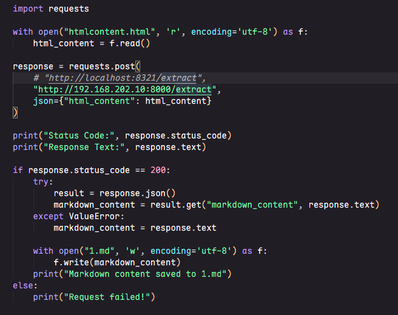

> 算法已经非常稳健，切勿修改任何一个数字和字符，每一个分值的计算和确定都是大量的测试数据得到的经验。

# HTML to Markdown Content Extractor API 文档


## 接口列表

### 获取API信息

**接口地址**: `GET /`

**接口描述**: 获取API基本信息和可用端点列表

**请求参数**: 无

**响应示例**:
```json
{
  "message": "HTML to Markdown Content Extractor API",
  "version": "2.0.0",
  "endpoints": {
    "/extract": "POST - 提取正文",
    "/health": "GET - 健康检查"
  }
}
```

### 健康检查

**接口地址**: `GET /health`

**接口描述**: 检查服务运行状态

**请求参数**: 无

**响应示例**:
```json
{
  "status": "healthy",
  "timestamp": "2025-12-10T10:30:00.000000"
}
```

### 提取HTML内容

**接口地址**: `POST /extract`


### HTMLInput


| 字段名 | 类型 | 必填 | 描述 | 示例值 |
|--------|------|------|------|--------|
| html_content | string | 是 | 待处理的HTML内容 | `"<html>...</html>"` |
| url | string | 否 | 源页面URL（当前版本未使用） | `"https://example.com"` |

### MarkdownOutput


| 字段名 | 类型 | 描述 | 示例值 |
|--------|------|------|--------|
| markdown_content | string | 提取的Markdown格式正文内容 | `"# 标题\n\n正文内容..."` |
| html_content | string | 提取的HTML格式正文内容（已清理） | `"<div><p>正文内容</p></div>"` |
| xpath | string | 定位到内容容器的XPath表达式 | `"//div[@id='content']"` |
| status | string | 处理状态用于记录程序内部错误：`success` 或 `failed` | `"success"` |
| process_time | float | 接口处理时间（秒） | `0.235` |
| header_content_text | string | 正文之上的内容（标题、面包屑等） | `"首页 > 新闻 > 正文"` |
| cl_content_html | string | 清理过后的正文HTML（去除标题和正文间的无关内容） | `"<div><p>清理后的正文</p></div>"` |
| cl_content_md | string | 清理过后的正文Markdown | `"清理后的正文"` |
| cl_content_text | string | 清理过后的正文纯文本 | `"清理后的正文"` |
| extract_success | boolean | 正文提取是否成功 | `True` |

> 需要关注、使用的字段为：header_content_text、cl_content_html、cl_content_md、cl_content_text、extract_success，这些字段可能会出现以下两种情况：
1. 当`extract_success`为 `True` 时,表示正文提取成功
    * 但此时`header_content_text`可能是空的，此字段为空时标志着文章header提取失败
2. 当`extract_success`为 `False` 时,表示正文提取失败
    * 此时`cl_content_html`、`cl_content_md`、`cl_content_text`三个值可能依然存在内容，但请忽略，使用原始输入的html作为正文即可
    * `header_content_text`此时该字段可能不为空，依然存在内容，这种情况一定概率是程序将正文内容识别为了header而放到了header里面，导致正文字段无内容，请自行处理。


## 错误码说明

| HTTP状态码 | 错误类型 | 说明 | 示例响应 |
|------------|----------|------|----------|
| 400 | Bad Request | 请求参数错误，如HTML内容为空 | `{"detail": "HTML内容不能为空"}` |
| 422 | Unprocessable Entity | 无法从HTML中提取有效内容 | `{"detail": "无法从HTML中提取有效内容"}` |
| 500 | Internal Server Error | 服务器内部错误 | `{"detail": "服务器内部错误: 具体错误信息"}` |


### 代码示例



### 使用步骤：


1. 先进入虚拟环境，要是误删除了虚拟环境文件，就按照requirement_updated重新安装

```shell
. venv/bin/activate 
```
2. 看看配置文件里面的是否符合你的要求

3. 然后进行部署

```shell
chmod +x deploy.sh
./deploy.sh
```

当然可以！以下是对你提供的 **Nginx 负载均衡部署与调试指南** 的整理和美化版本，结构清晰、重点突出，便于团队协作或文档归档使用：

---

# 🌐 Nginx 负载均衡部署与调试指南

在单台服务器上部署多个后端服务（如 Gunicorn 应用），并通过 **Nginx 实现负载均衡**，具有以下优势：

- 提升整体吞吐能力，分摊高并发压力；
- 支持**滚动更新**：可下线一个实例进行优化/修复，其余实例继续提供服务，保障可用性。

---

## 1️⃣ Nginx 配置文件设置

配置路径：`/etc/nginx/nginx.conf`

在 `http` 块中添加如下内容：

```nginx
upstream htmlparser {
    # 后端服务地址（Gunicorn 监听端口）
    server 127.0.0.1:8001;
    server 127.0.0.1:8002;

    # 保持与后端的长连接池（对高并发至关重要）
    keepalive 32;
}

server {
    listen       8000;
    server_name  192.168.182.41;  # 可替换为实际 IP 或域名

    location / {
        proxy_pass http://htmlparser;

        # === 基础代理头 ===
        proxy_set_header Host $host;
        proxy_set_header X-Real-IP $remote_addr;
        proxy_set_header X-Forwarded-For $proxy_add_x_forwarded_for;

        # === 关键优化：启用 HTTP/1.1 ===
        proxy_http_version 1.1;

        # === 支持 WebSocket 与 Keep-Alive ===
        proxy_set_header Upgrade $http_upgrade;
        proxy_set_header Connection "upgrade";
    }
}
```
然后执行`/usr/local/nginx/sbin/nginx -t`,看是否输出successful，表明nginx.conf是没有问题的

> ✅ **新增服务时**：只需在 `upstream` 块中追加一行 `server 127.0.0.1:<新端口>;` 即可。

---

## 2️⃣ 启动前准备：清理旧进程 & SELinux 配置

### 🔍 查找并终止占用端口的旧进程

```bash
# 查看 80 或 8000 端口占用情况
netstat -ntlp | grep -E ':80|:8000'

# 强制终止指定 PID（替换 <PID> 为实际进程 ID）
kill -9 <PID>

# 或直接杀掉所有 nginx 进程
killall nginx
```

### 🔒 解决 SELinux 权限问题

#### ① 允许 Nginx 绑定 8000 端口（非标准 HTTP 端口）

```bash
# 安装策略管理工具（若未安装）
yum install -y policycoreutils-python-utils

# 将 8000 加入允许的 HTTP 端口列表
semanage port -a -t http_port_t -p tcp 8000
```

#### ② 允许 Nginx 连接上游后端（解决 502 Bad Gateway）

```bash
# 允许 httpd（即 Nginx）发起网络连接
setsebool -P httpd_can_network_connect 1
```

> ⚠️ **注意**：务必先启动后端服务，再启动 Nginx！

---

## 3️⃣ 启动服务流程

```bash
# 1. 启动后端服务（例如通过 deploy.sh）
chmod +x deploy.sh
./deploy.sh

# 2. 启动 Nginx
systemctl start nginx
```

---

## 4️⃣ 验证负载均衡是否生效

### 方法：观察日志轮询

**终端窗口 1**：实时监控两个后端的日志  
```bash
tail -f access_8001.log access_8002.log
```

**终端窗口 2**：连续发送请求  
```bash
for i in {1..6}; do
    curl http://127.0.0.1:8000/health
    echo ""
done
```

✅ **预期现象**：日志中交替出现来自 `8001` 和 `8002` 的访问记录，证明 **轮询（Round-Robin）负载均衡已生效**。

---

## 5️⃣ 接口功能验证

测试全链路连通性：

```bash
curl -v http://127.0.0.1:8000/health
```

- 若返回 `HTTP/1.1 200 OK` → 服务正常；
- 若返回 `405 Method Not Allowed` → 后端已响应（接口存在但方法不支持），也说明链路通畅；
- 若返回 `502 Bad Gateway` → 检查后端是否启动、SELinux 设置或防火墙。

---

## ✅ 总结

| 步骤 | 操作 |
|------|------|
| 配置 | 修改 `/etc/nginx/nginx.conf`，定义 `upstream` |
| 清理 | 杀掉旧进程，释放 8000 端口 |
| SELinux | 添加端口权限 + 开启网络连接 |
| 启动顺序 | 先后端 → 再 Nginx |
| 验证 | 日志轮询 + 接口测试 |

> 💡 提示：生产环境中建议配合 `systemd` 管理后端服务，并使用 `nginx -t` 测试配置语法后再重载。

---

如有更多需求（如权重分配、健康检查、会话保持等），可进一步扩展 `upstream` 配置。
